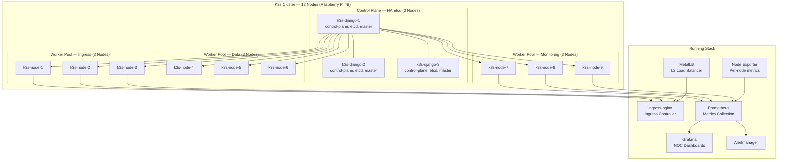

# Ced's K3s HomeLab — 12-Node Raspberry Pi Cluster

> A fully high-availability K3s Kubernetes cluster running on Raspberry Pi 4B hardware — purpose-built to mirror production Kubernetes patterns at lab scale, and serve as the orchestration backbone for Ced's NOC.

[](#node-inventory)
[](https://k3s.io)
[](https://www.debian.org)
[](#cluster-health)
[](https://noc.chasedumphord.com)

---

## Why I Built This

This cluster didn't get added to the homelab because a tutorial said to. It got added because I needed a dedicated orchestration layer that could run the full Ced's NOC observability stack — Prometheus, Grafana, Alertmanager, and Node Exporter across every node — without competing for resources with the Proxmox cluster doing virtualization work.

Twelve Raspberry Pi 4B nodes. Three dedicated control plane nodes running etcd in HA mode. Nine workers split by workload type — ingress, data, and monitoring. MetalLB handling LoadBalancer IPs natively on the HomeLab VLAN. Every node running Debian 12 Bookworm with containerd as the runtime.

It's been running for 117+ days without a cluster failure. That's not luck — that's what proper HA control plane design gets you.

---

## Architecture Overview



---

## Node Inventory

### Control Plane — 3 Nodes

| Node | Role | OS | Runtime |
|------|------|----|---------|
| k3s-django-1 | control-plane, etcd, master | Debian 12 Bookworm | containerd 2.1.5 |
| k3s-django-2 | control-plane, etcd, master | Debian 12 Bookworm | containerd 2.1.5 |
| k3s-django-3 | control-plane, etcd, master | Debian 12 Bookworm | containerd 2.1.5 |

### Worker Nodes — 9 Nodes

| Node | Pool | OS | Runtime |
|------|------|----|---------|
| k3s-node-1 | Ingress | Debian 12 Bookworm | containerd 2.1.5 |
| k3s-node-2 | Ingress | Debian 12 Bookworm | containerd 2.1.5 |
| k3s-node-3 | Ingress | Debian 12 Bookworm | containerd 2.1.5 |
| k3s-node-4 | Data | Debian 12 Bookworm | containerd 2.1.5 |
| k3s-node-5 | Data | Debian 12 Bookworm | containerd 2.1.5 |
| k3s-node-6 | Data | Debian 12 Bookworm | containerd 2.1.5 |
| k3s-node-7 | Monitoring | Debian 12 Bookworm | containerd 2.1.5 |
| k3s-node-8 | Monitoring | Debian 12 Bookworm | containerd 2.1.5 |
| k3s-node-9 | Monitoring | Debian 12 Bookworm | containerd 2.1.5 |

### Hardware

| Spec | Detail |
|------|--------|
| Model | Raspberry Pi 4B |
| RAM | 8GB per node |
| Storage | 64GB SD card per node |
| OS | Debian GNU/Linux 12 (Bookworm) |
| Kernel | 6.12.x / 6.6.x rpt-rpi-v8 |
| K3s version | v1.33.6+k3s1 |

---

## Running Stack

Everything below has been confirmed running via `kubectl get pods -A`.

### MetalLB — L2 Load Balancer

Provides native LoadBalancer IP assignment on the HomeLab VLAN (`10.10.30.0/24`). One MetalLB speaker pod runs on every node in the cluster for L2 advertisement.

### ingress-nginx — Ingress Controller

Handles all HTTP/HTTPS routing into the cluster. Routes traffic to internal services based on hostname rules defined in ingress manifests.

### kube-prometheus-stack — Ced's NOC

The full observability stack deployed via Helm:

| Component | Namespace | Status |
|-----------|-----------|--------|
| Prometheus | monitoring | Running — 117d+ |
| Grafana | monitoring | Running — 117d+ |
| Alertmanager | monitoring | Running — 117d+ |
| Node Exporter | monitoring | Running on all 12 nodes |
| kube-state-metrics | monitoring | Running |
| metrics-server | kube-system | Running |

Node Exporter runs as a DaemonSet — one pod per node — giving Grafana per-node CPU, RAM, disk, and network metrics across the entire cluster.

📺 **[View Live NOC Dashboard →](https://noc.chasedumphord.com)**

---

## Repository Structure

```
ced-k3s-homelab/
├── dashboards/             # Grafana dashboard JSON exports (Ced's NOC)
│   └── ced-noc/
├── diagrams/               # Architecture diagrams
│   └── ced-k3s-from-text.txt   # draw.io importable diagram
├── docs/
│   └── per-node-notes.md   # Per-node inventory (IP, role, hardware)
├── manifests/
│   ├── demo-app/           # demo-nginx workload
│   └── ingress/            # Grafana + Prometheus ingress rules
├── scripts/
│   ├── 03_label_nodes.sh   # Label nodes into ingress/data/monitoring pools
│   ├── 10_install_metallb.sh
│   ├── 20_install_ingress_nginx.sh
│   └── 30_install_ceds_noc.sh
├── bootstrap.sh            # Full cluster bootstrap entry point
├── cluster-setup.md        # Step-by-step narrative of the full setup
├── kube-prom-values.yaml   # Helm values for kube-prometheus-stack
└── Makefile                # Task runner for common cluster operations
```

---

## Cluster Health

Confirmed cluster state as of last documentation update:

```
NAME            STATUS   ROLES                        AGE    VERSION
k3s-django-1    Ready    control-plane,etcd,master    117d   v1.33.6+k3s1
k3s-django-2    Ready    control-plane,etcd,master    117d   v1.33.6+k3s1
k3s-django-3    Ready    control-plane,etcd,master    117d   v1.33.6+k3s1
k3s-node-1      Ready    ingress                      117d   v1.33.6+k3s1
k3s-node-2      Ready    ingress                      117d   v1.33.6+k3s1
k3s-node-3      Ready    ingress                      117d   v1.33.6+k3s1
k3s-node-4      Ready    data                         117d   v1.33.6+k3s1
k3s-node-5      Ready    data                         117d   v1.33.6+k3s1
k3s-node-6      Ready    data                         117d   v1.33.6+k3s1
k3s-node-7      Ready    monitoring                   117d   v1.33.6+k3s1
k3s-node-8      Ready    monitoring                   117d   v1.33.6+k3s1
k3s-node-9      Ready    monitoring                   117d   v1.33.6+k3s1
```

---

## Quick Start

> For full setup narrative see [`cluster-setup.md`](./cluster-setup.md)

On `k3s-django-1` with `KUBECONFIG` pointing at the cluster:

```bash
git clone https://github.com/ced4568/ced-k3s-homelab
cd ced-k3s-homelab

# 1. Label nodes into workload pools
./scripts/03_label_nodes.sh

# 2. Install MetalLB
./scripts/10_install_metallb.sh

# 3. Install ingress-nginx
./scripts/20_install_ingress_nginx.sh

# 4. Deploy Ced's NOC (kube-prometheus-stack)
./scripts/30_install_ceds_noc.sh

# 5. Apply ingress rules
kubectl apply -f manifests/ingress/grafana-ingress.yaml
kubectl apply -f manifests/ingress/prometheus-ingress.yaml
```

---

## Roadmap

- [x] 12-node K3s cluster on Raspberry Pi 4B
- [x] HA control plane with 3-node etcd
- [x] Node labeling by workload pool (ingress, data, monitoring)
- [x] MetalLB L2 load balancer
- [x] ingress-nginx ingress controller
- [x] kube-prometheus-stack (Prometheus + Grafana + Alertmanager)
- [x] Node Exporter on all 12 nodes
- [x] 117+ days continuous uptime
- [ ] GitOps with ArgoCD
- [ ] Helm chart library for additional workloads
- [ ] Internal container registry
- [ ] Persistent storage via NFS from TrueNAS
- [ ] Automated certificate management with cert-manager
- [ ] Grafana alerting rules and notification channels

---

## Related Projects

| Project | Description |
|---------|-------------|
| [ceds-homelab](https://github.com/ced4568/ceds-homelab) | Parent homelab — 6-node Proxmox cluster, TrueNAS, full infrastructure |
| [ceds-aprs-igate](https://github.com/ced4568/ceds-aprs-igate) | Dual-node APRS RF-to-internet iGate (KJ5JCO) |
| [ced-portfolio](https://github.com/ced4568/ced-portfolio) | Source for chasedumphord.com |

---

## Author

**Chase Dumphord (Ced)**
Digital Systems Engineer · GE Aerospace · Oxford, MS

[](https://chasedumphord.com)
[](https://www.linkedin.com/in/chase-dumphord/)
[](https://github.com/ced4568)
[](https://noc.chasedumphord.com)